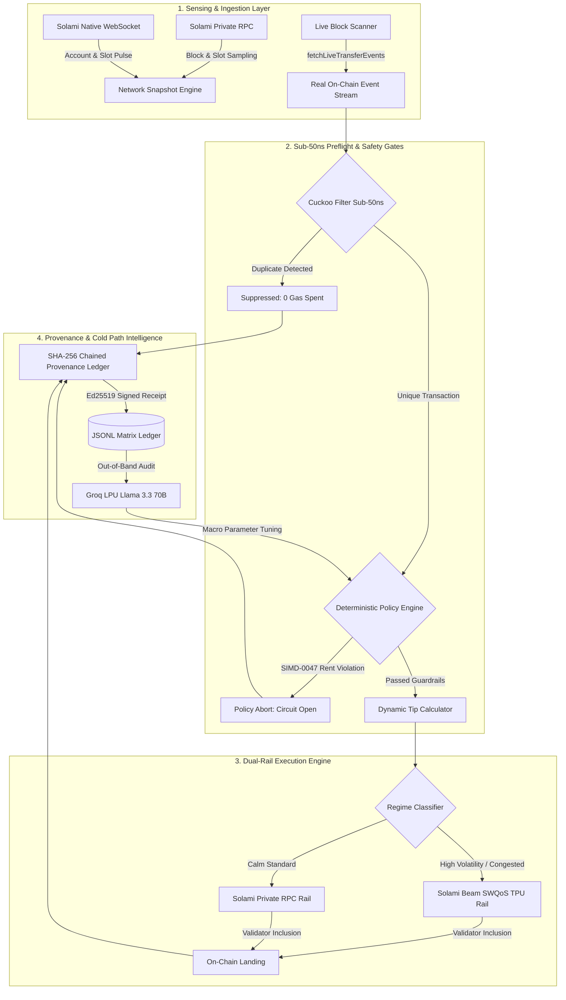

# System Architecture

## 1. Architectural Philosophy

Sentry 2.0 is built on the principle of **strict latency decoupling**. 

In high-frequency decentralized finance, market conditions shift in fractions of a slot (~400ms). If an execution engine attempts to make a remote HTTP request to an AI model while preparing a transaction, the network blockhash expires, liquidity pools move, and the transaction fails.

To solve this, Sentry 2.0 introduces a dual-path architecture:
- **The Deterministic Hot Path (sub-1ms)**: Executes entirely locally. Evaluates the sub-50ns Cuckoo filter deduplicator, checks deterministic safety gates (SIMD-0047 rent floors, circuit breakers), queries dynamic tip caches, and dispatches directly to Solami Beam's SWQoS TPU socket.
- **The Cognitive Cold Path (Groq LPU)**: Runs asynchronously out-of-band. Processes telemetry batches, audits execution receipts, performs root-cause classification on failed transactions, and tunes macro policies without ever blocking active transactions.

---

## 2. End-to-End System Diagram



---

## 3. Core Subsystems Deep Dive

### 3.1 Network Snapshot & Regime Classifier
- **Source**: `lib/network-snapshot.ts`
- **Function**: Samples slot velocity, leader distance, and compute unit consumption across rolling 10-slot windows over Solami Private RPC.
- **Regime States**: Classifies the current on-chain environment into one of five states:
  - `calm`: Normal block utilization, low base tips (under 2,000 lamports).
  - `moderate`: Steady transaction volume, standard tips (2,000 to 5,000 lamports).
  - `congested`: Blockspace competition, elevated tips (5,000 to 15,000 lamports).
  - `extreme`: Heavy DEX competition, rapid tip escalation (15,000 to 50,000 lamports).
  - `volatile`: Extreme price fluctuations or liquidation waves, maximum SWQoS priority routing.

### 3.2 Sub-50ns Cuckoo Filter Deduplication
- **Source**: `lib/cuckoo-filter.ts`
- **Function**: Mathematical partial-key Cuckoo filter with 4 slots per bucket and 16-bit FNV-1a fingerprints.
- **Window Eviction**: Operates a 150-slot sliding window (`SlidingWindowCuckooDeduplicator`) that exactly mirrors Solana's 150-slot blockhash lifetime.
- **Performance**: Performs lookups in under 50 nanoseconds with zero heap allocation per check, catching transaction storms before they reach RPC.

### 3.3 Deterministic Policy Engine
- **Source**: `lib/policy-engine.ts`
- **Function**: Enforces strict mathematical invariants that remote AI models cannot override:
  - **SIMD-0047 Rent Protection**: Enforces an inviolable minimum floor of 650,240 lamports, preventing operator wallet de-allocation.
  - **Circuit Breaker State Machine**: Automatically transitions from `Closed` to `Open` when consecutive simulation or RPC failures exceed thresholds.
  - **Maximum Tip Budget**: Binds priority fees to predetermined risk limits.

### 3.4 Solami Beam SWQoS Dispatcher
- **Source**: `lib/action-engine.ts` and `engine/src/beam.rs`
- **Function**: Communicates with `https://beam.solami.dev:11000` to deliver transactions directly to validator TPU sockets over Stake-Weighted Quality of Service lines.
- **Tip Injection**: Queries `https://api.solami.dev/onchain/tip-addresses` dynamically to append micro-tips directly to active `...beam` sink accounts.

### 3.5 Cryptographic Evidence Engine
- **Source**: `lib/evidence-engine.ts`
- **Function**: Generates an append-only ledger where each receipt $R_i$ satisfies:
```text
ReceiptHash_i = SHA-256(i || scenarioId || tip || status || sig || ReceiptHash_{i-1})
EngineSignature_i = Ed25519-Sign(ReceiptHash_i, PrivateKey)
```
  This guarantees mathematical immutability and complete auditability.

---

## 4. Rust Confirmation Kernel

The native Rust subsystem (`engine/`) provides low-overhead, zero-allocation confirmation tracking:
- **`main.rs`**: Orchestrates Tokio asynchronous threads, boots the Solami RPC slot poller, and manages priority transactions.
- **`beam.rs`**: Interfaces with Solami Beam SWQoS endpoints for direct TPU socket streaming.
- **`geyser.rs`**: High-performance Yellowstone gRPC client providing microsecond-precision confirmation events.
- **`lifecycle.rs`**: Multi-stage latency tracking measuring Processed to Confirmed to Finalized deltas.

---

## 5. Memory Management and Leak Prevention

To run indefinitely in production environments, Sentry 2.0 enforces three memory management rules:
1. **Sliding Window Expiration**: The Cuckoo filter automatically sweeps entries older than 150 slots. Memory usage stays strictly constant ($O(1)$) regardless of total execution count.
2. **Streaming Log Rotation**: Receipts are streamed sequentially to JSONL files on disk rather than accumulated in memory.
3. **Connection Pooling**: Solami RPC and WebSocket connections use persistent HTTP keep-alive and WebSocket reconnection backoffs with jitter, preventing socket descriptor exhaustion.
